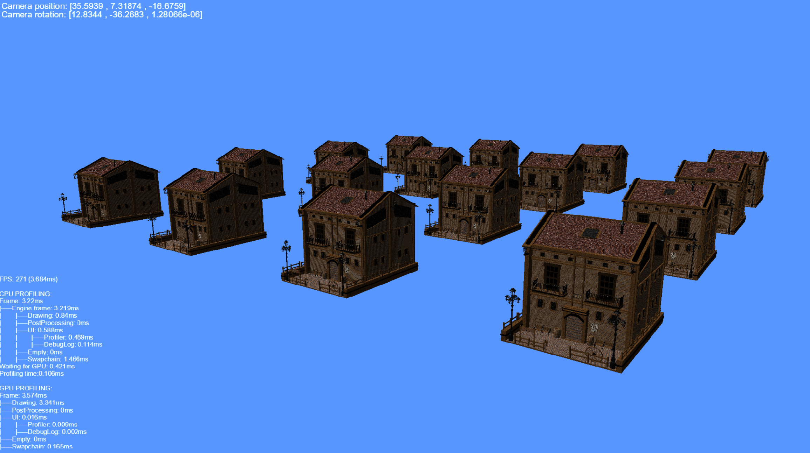
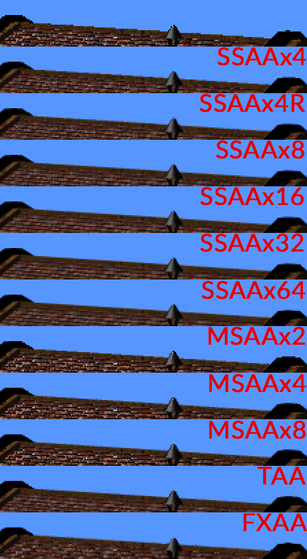
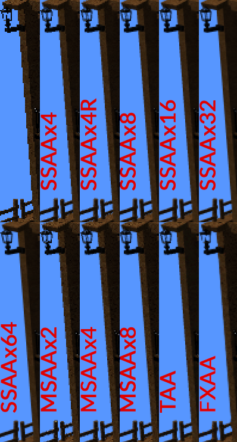
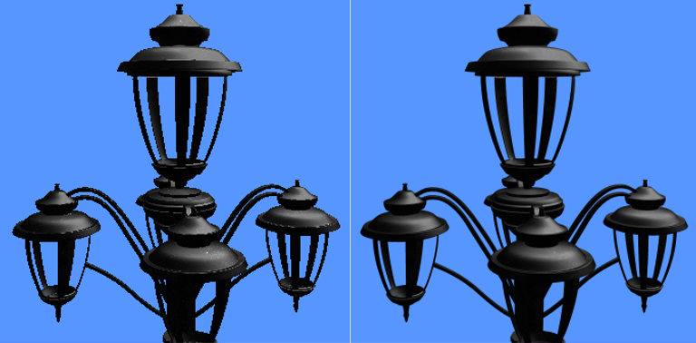

# AntiAliasingSandbox
The main goal of this project was to learn and implement:
- Basics of D3D11
- Use so few external libraries as possible (or make sense as I was time-contrained)
- Implement the most popular antialiasing algorithms like: SSAA, MSAA, TAA, FXAA
- Implement tools which will let me compare these algorithms visual and performance-wise. Application has a benchmark mode which analyzes performance of all algorithms and makes screenshots

## Scene

## Horizontal edges

## Vertical edges

## Before and after AA pass

